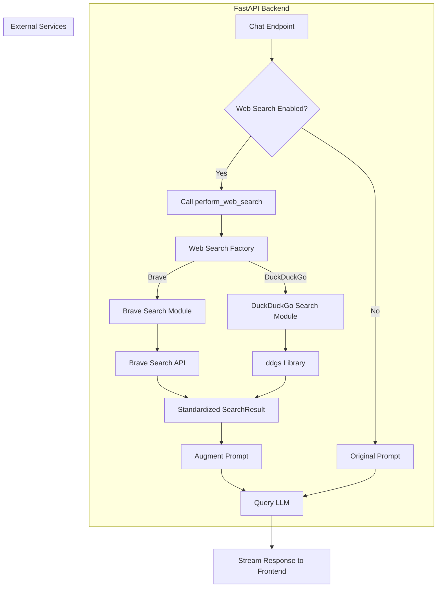

# Revised Web Search Implementation Plan for ShiancoChat

## 1. Overview

This document outlines a revised plan for integrating web search functionality into ShiancoChat. The new approach is inspired by the modular and extensible architecture of `open-webui` and aims to create a more robust, flexible, and maintainable system.

## 2. Key Improvements

The revised plan introduces the following key improvements:

*   **Multi-Provider Architecture**: Instead of being tied to a single search provider, the new architecture will support multiple search engines (e.g., DuckDuckGo, Brave, Google).
*   **Direct API Integration**: We will integrate directly with search engine APIs using Python libraries, removing the dependency on MCP tools. This will simplify the code, improve performance, and give us more control over the search process.
*   **Configuration-Driven**: The choice of search engine and all associated API keys will be managed through environment variables, allowing for easy configuration without any code changes.
*   **Standardized Output**: A Pydantic model will be used to define a standardized data structure for search results, ensuring consistency across all providers.

## 3. Revised Architecture

The revised architecture will be implemented as follows:

### Backend Changes (FastAPI)

*   **New `web_search` Directory**: A new directory will be created at `backend/utils/web_search`.
*   **Provider-Specific Modules**: Inside `backend/utils/web_search`, we will create separate Python modules for each search provider (e.g., `duckduckgo.py`, `brave.py`). Each module will contain a `search()` function that takes a query and returns a list of `SearchResult` objects.
*   **`SearchResult` Model**: A `SearchResult` Pydantic model will be defined in `backend/utils/web_search/models.py` to ensure a consistent output format.
*   **Search Factory**: A `main.py` file in `backend/utils/web_search` will act as a factory, dynamically selecting the appropriate search provider based on the `WEB_SEARCH_ENGINE` environment variable.
*   **Updated `search.py`**: The existing `backend/utils/search.py` file will be updated to use the new `web_search` factory. The `perform_web_search()` function will be simplified to just a few lines of code.
*   **Environment Variables**: The following environment variables will be used to configure the web search functionality:
    *   `WEB_SEARCH_ENGINE`: The search engine to use (e.g., `duckduckgo`, `brave`).
    *   `BRAVE_API_KEY`: The API key for the Brave Search API.

### Frontend Changes (React)

No immediate changes are required for the frontend. The existing "Web Search" toggle in the `ChatInput` component will continue to work as expected. In the future, the UI could be enhanced to allow users to select their preferred search engine.

### Mermaid Diagram

## 4. Next Steps

1.  Implement the revised architecture in code mode.
2.  Test the new implementation with multiple search providers.
3.  Update the documentation to reflect the new architecture.